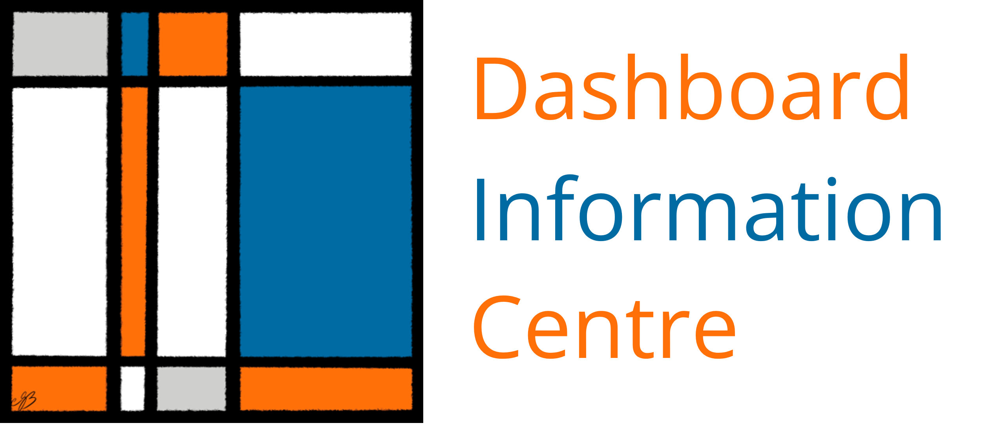
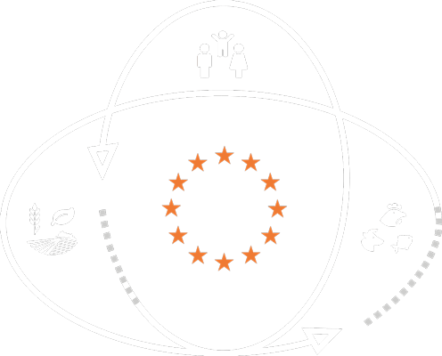

 

# Dashboard Information Centre:   A practical manual for One Health Surveillance Dashboards
{: .no_toc }

  

    Contents
  

  {: .text-delta }
1. Contents
{:toc}

 
This website serves as an information centre and practical manual for the development of interactive dashboards for One Health disease surveillance in Europe, and an inventory of existing dashboards. It was produced within Work Package 6 (WP6) of the [MATRIX](https://onehealthejp.eu/jip-matrix/) project. MATRIX is part of [the One Health European Joint Programme (EJP)](https://onehealthejp.eu/), a partnership between 44 food, veterinary and medical laboratories and institutes across 22 European nations and the [Med-Vet-Net Association](https://www.mvnassociation.org/).

One Health Surveillance (OHS) is the combination of health surveillance data and knowledge from the three health sectors &mdash; public health (PH), animal health (AH) and food safety (FS) &mdash; in order to understand how the health of humans, animals and the environment are connected and affect each other.

## MATRIX and WP6

[MATRIX](https://onehealthejp.eu/jip-matrix/) aims to advance the implementation of OHS in practice, by building on existing resources, adding value to them and creating synergies among the sectors. In particular, the goal is to identify and describe existing cross-sectorial OHS programmes or potential programmes, and extend the efforts of existing integrative OHEJP projects which focus on separate or only two sectors.

Work Package 6 focuses on visualisation of OHS inputs and outputs for the use of surveillance officials in PH, AH and FS. This will be achieved through the creation of dashboards, which will include surveillance data from all three sectors.

A dashboard is a form of graphical user interface which displays data and metrics in a way that facilitates tracking, analysis and monitoring to inform decision-making. A disease surveillance dashboard might contain charts, tables, maps or other elements providing a comprehensive overview of the development of the disease in question, or even predicting future outbreak events.

Each participating country will construct a dashboard for the surveillance of a zoonotic pathogen of their choice. Dashboards will be coded using open-source tools, and will include not only data and statistical outputs, but also all important surveillance information for specific zoonoses such as contact persons, workflow, and regulations, as such depicting the full OHS structure for that hazard.

### The Information Centre

The [ORION](https://onehealthejp.eu/jip-orion/) project has identified data sources that are already public or shared across sectors. The [NOVA](https://onehealthejp.eu/jrp-nova/) project is building automated routines for data analyses and visualisation when trend monitoring is possible. The MATRIX project builds on these results and the experience gained through the dashboard development work to create an information centre which will serve as a best-practice guide for OHS dashboards. This will document important aspects such as:

* Information context and end-user considerations: what information does a surveillance official need on their everyday work, and in case of emergency? What kind of data can provide that information?
* Technical and legal barriers associated with data sharing across sectors.
* Possible pitfalls and biases when One Health data is co-analysed.
* Choosing the most suitable technical solution based on the data, available resources and desired outcomes.

This information centre will also function as an inventory and showcase of all planned, ongoing and finished dashboard activities within MATRIX, so that the provided information can be exemplified by real-world implementations.

### Member Contributions

The efforts in Work Package 6 of MATRIX are led by the Swedish National Veterinary Institute ([SVA](https://www.sva.se/en/)), and the Norwegian Institute of Public Health ([NIPH](https://www.fhi.no/en/)). The following institutes are also contributing to WP6:

* The French Agency for Food, Environmental and Occupational Health & Safety ([ANSES](https://www.anses.fr/en))
* The German Federal Institute for Risk Assessment ([BfR](https://www.bfr.bund.de/en/home.html))
* The Friedrich-Loeffler-Institut ([FLI](https://www.fli.de/en/startpage/)), Germany
* The Norwegian Veterinary Institute ([NVI](https://www.vetinst.no/en))
* Statens Serum Institut ([SSI](https://en.ssi.dk/)), Denmark
* The Animal and Plant Health Agency ([APHA](https://www.gov.uk/government/organisations/animal-and-plant-health-agency)), United Kingdom
* The University of Surrey ([UoS](https://www.surrey.ac.uk/)), United Kingdom
* The Istituto Zooprofilattico Sperimentale dell'Abruzzo e del Molise "Giuseppe Caporale" ([IZSAM](https://www.izs.it/IZS/Engine/RAServePG.php)), Italy
* The National Veterinary Research Institute ([PIWET](http://www.piwet.pulawy.pl/)), Poland
* The Instituto Nacional de Saúde Doutor Ricardo Jorge ([INSA](http://www.insa.min-saude.pt/)), Portugal
* The Public Health Agency of Sweden ([FoHM](https://www.folkhalsomyndigheten.se/the-public-health-agency-of-sweden/))
* The National Institute for Public Health and the Environment ([RIVM](https://www.rivm.nl/en)), The Netherlands
* The Finnish Food Authority ([RUOKA](https://www.ruokavirasto.fi/en/))

The table below is a summary of all planned, ongoing or finished dashboard projects by institutes that are part of WP6, which will form the basis for the information provided in this website.

| Name                | Institute(s) | Stage                     | Hazard in focus                                         | Input                                                   | Output                                                                                                                                          | Target audience(s)                                                                              | Technology/platform                                                                           | URL                                                                                  |
| ------------------- | ------------ | ------------------------- | ------------------------------------------------------- | ------------------------------------------------------- | ----------------------------------------------------------------------------------------------------------------------------------------------- | ----------------------------------------------------------------------------------------------- | --------------------------------------------------------------------------------------------- | ------------------------------------------------------------------------------------ |
|Disease Dashboards | SVA, (FOHM)    | Under development                  | Animal Health hazards and zoonotic agents (starting with *Salmonella*)   | Curated data from annual disease surveillance, results from screenings, continuous test result data from lab, expert opinions  | Disease-specific surveillance summary dashboards                                                                                                | Health & surveillance professionals, public                                                                    | R, R Shiny, HTML, JavaScript                                                                           |                                                                                      |
| Survboard           | RIVM         | Finished (outside MATRIX) | Infectious zoonotic diseases                            | Online disease notification system                      | Dashboard with summaries per agent - figures and table                                                                                          | Internal RIVM + selected experts                                                                | R Shiny                                                                                       |                                                                                      |
| RESAPATH on line    | ANSES        | Finished                  | AMR in animals                                          | Annual surveillance data from RESAPATH                  | Public interactive dashboard                                                                                                                    | Veterinarians, laboratories, public                                                             | MySQL, R, R Shiny                                                                             | [https://shiny-public.anses.fr/resapath2/](https://shiny-public.anses.fr/resapath2/) |
|Sykdomspulsen One Health | NIPH, NVI, Norwegian Food Safety Authority    | Piloting         | Campylobacter in animals and humans | Human and vet lab results, diagnosis codes from doctors, weather data | Dashboard of diagnostic results and statistics                                                                                                  | People working with surveillance in PH and AH, possibly FS authority                            | R, Apache, R Shiny                                                                            |                                                                                      |
| GENPAT              | IZSAM        | Finished                  | Listeria, campylobacter, brucella, WND, SARS-CoV-2      | WGS data from NRLs and NRCs. Based on COHESIVE system   | Dashboard combining WGS data, metadata and GIS data                                                                                             | Official control authorities, health and sruveillance professionals                             | CMDBuild (data), nextflow (calculations), OpenStreetMap + grapetree + phylocanvas (dashboard) |                                                                                      |
| EU-EpiCap dashboard | ANSES, UoS   | Prototype stage           |                                                         | Data on a OH surveillance system under evaluation       | Evaluation of OH surveillance capacities, visualisation of these assessments, mapping of actors and interactions in the OH surveillance network | Those involved in evaluating OH surveillance systems in member states; PH, AH and FS institutes | R Shiny with integrated HTML and JS widgets                                                   |                                                                                      |
| TSIS                | FLI          | Finished                  | Notifiable animal diseases                              | German national animal disease notification system      | Tabulated data and a map                                                                                                                        | Anyone                                                                                          |                                                                                               | [https://tsis.fli.de/Default.aspx](https://tsis.fli.de/Default.aspx)                 |
